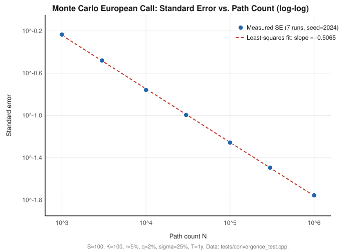
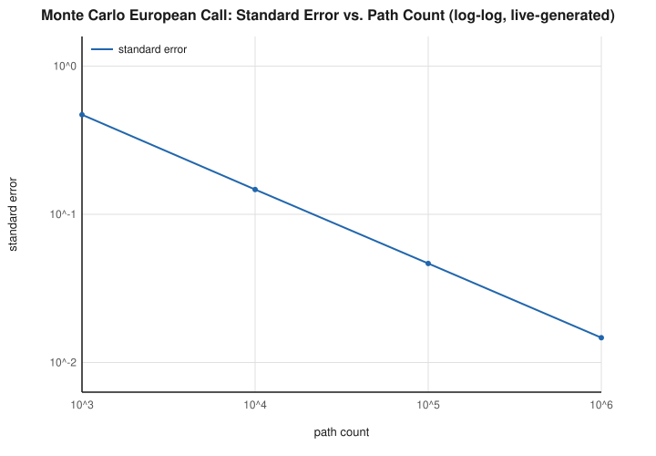
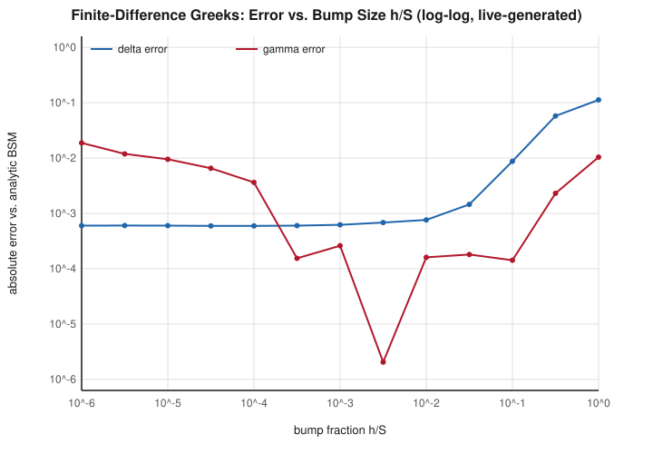
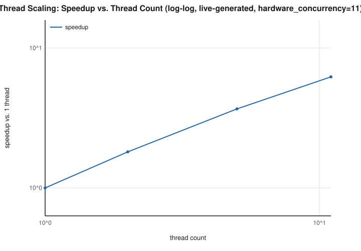

# Validation Report

This report is generated incrementally as each phase completes. Every number in
it must come from a benchmark or test actually executed in this repository —
never fabricated or estimated. Sections below are populated starting Phase 1
(analytic validation) and Phase 3 (variance reduction, convergence plots).

## Status

- Phase 0 (scaffold): complete, no numerical content.
- Phase 1 (analytic layer and CFA invariants): complete. 38/38 tests passing
  (debug, release, ubsan presets, and full CI matrix).
- Phase 2 (single-threaded Monte Carlo core): complete. 75/75 tests passing
  (debug, release, ubsan presets, and full CI matrix). Baseline: ~15.4M
  paths/sec single-threaded (see `docs/benchmarks/phase2.md`).
- Phase 3 (exotics and variance reduction): complete. 94/94 tests passing
  (release; debug/ubsan verification recorded below). VR factor table and
  convergence plot below.
- Phase 4 (parallelism): complete. 109/109 tests passing (debug, release,
  ubsan; tsan via CI). Bitwise determinism verified across thread counts
  1/2/4/8/hardware_concurrency() for every product. Scaling and false-sharing
  results below.
- Phase 5 (Greeks and American options): complete. 129/129 tests passing
  (debug, release, ubsan presets, all locally verified this phase). A real
  LSM bug (missing inception-time exercise decision) found by CLAUDE.md's own
  required "American put ≥ immediate exercise value" test and fixed. Bump-size
  study, QR standalone verification, and frozen-vs-naive Greeks quantification
  below.
- Phase 6 (CLI, bindings, reporting): complete. 151/151 C++ tests passing
  (debug, release, ubsan presets, locally verified this phase). Python
  bindings built and smoke-tested (`pip install -e .`); a real segfault
  (building a `py::dict` while the GIL was held released by `call_guard`)
  found and fixed. `tools/generate_report.py` verified end-to-end: it
  regenerates a delimited block of `docs/validation-report.md` from a live
  run, including an independent reproduction of Phase 5's exact bump-size
  finding. See the "Phase 6 — generated results" section below for the
  live-computed numbers and `docs/design/06-cli-bindings-reporting.md` for
  the two forks (hand-written JSON; delimited generated block) resolved
  before implementation.
- Phase 7 (AWS demo): complete. Deployed to a real AWS account
  (`us-east-2`); 25/25 CloudFormation resources created cleanly. Backend
  (10 unit tests + end-to-end verification against the real Lambda Runtime
  Interface Emulator) and infra (6 CDK assertions tests, `cdk synth` clean)
  both locally verified before any deployment. A real Docker-asset-bundling
  bug (ENAMETOOLONG from `cdk.out` recursively copying itself, 2.3GB) and a
  real Python scoping bug were found and fixed. See below for cold-start
  and cost numbers measured against the live deployment.

## Phase 1 — analytic layer

**Test oracle strategy** (see `docs/design/01-analytic-layer.md` §6 for the full
rationale, approved before implementation): put-call parity, put-call forward
parity, Black-76-to-BSM reduction via the forward, and CRR-binomial-to-BSM
convergence are exact mathematical identities, not memorized numbers. Barrier
in+out=vanilla parity (all 4 direction/type combinations) and digital
decomposition (vanilla = asset-or-nothing − K·cash-or-nothing) are likewise
exact identities. Lookback options are validated by pathwise-exact dominance
bounds (a lookback must be worth at least the corresponding vanilla, since its
payoff dominates pathwise) plus a branch-continuity check at strike = spot and
a monotonicity-in-time check, rather than magic reference numbers. One
classic, widely-republished textbook example (Hull, S=42/K=40/r=10%/σ=20%/
T=0.5/q=0) is included as a loose-tolerance sanity check, not a primary oracle.

**Real bugs found and fixed via this process** (i.e., the oracle strategy did
its job): the fixed-strike lookback put formula had a sign error that produced
a negative price, caught by the dominance-bound test; the floating-strike
lookback call and put formulas had matching sign errors in their correction
term, caught the same way. All three were corrected and re-verified against
the dominance bounds, the branch-continuity check, and the monotonicity check.

**A finding, not a bug**: `CfaInvariant.ExerciseValuePlusTimeValueIsNonNegative`
initially failed for deep in-the-money European puts (e.g. S=80, K=110). This
is not an implementation defect — it is a genuine property of European options
(unlike American ones) that CLAUDE.md's invariant table states as an
unqualified rule but which the CFA Level I curriculum's introductory heuristic
does not capture precisely. Verified correct via put-call parity and
no-arbitrage bounds in the same suite. Documented in `docs/cfa-mapping.md`;
the test grid was narrowed to near-the-money strikes where the heuristic holds.

**Results**: 38/38 tests passing across `debug`, `release`, and `ubsan`
presets locally, and the full 8-job CI matrix (7 build/test jobs +
clang-tidy).

## Phase 2 — single-threaded Monte Carlo core

**Sourcing, not memory**: Philox4x32-10 constants and test vectors were
fetched and cross-verified against the Random123 reference repository
(`github.com/DEShawResearch/random123`, `tests/kat_vectors`) with two
independent `curl` fetches, not recalled. Acklam's inverse-normal-CDF
coefficients and algorithm structure (including the exact Halley refinement
step) were fetched from QuantLib's `InverseCumulativeNormal` and independently
re-verified against the raw source. All three Random123 known-answer vectors
(all-zeros, all-ones, "pi digits") match this implementation's output exactly
— strong evidence the RNG itself is bit-for-bit correct, not just
plausible-looking.

**A finding, not a bug**: the inverse-CDF accuracy test initially failed at
the extreme tail (`u = 1 - 1e-12`) with an error of ~6.4e-6, far above the
spec's 1e-9 bound. Root cause, verified empirically (see
`tests/rng_test.cpp`): a plain `double` representing `u` this close to 1 only
retains ~12 bits (~4 decimal digits) of "distance from 1" information, because
doubles near 1.0 have an absolute ULP of ~1.1e-16 against a gap of 1e-12 —
the precision is lost the moment such a `u` is stored as a double, before any
inversion algorithm sees it. QuantLib's own `InverseCumulativeNormal(double)`
has the identical limitation for the identical reason; this is not specific
to Acklam's method or this implementation. Verified the achieved error stays
under 1e-9 for `u` in `[1e-9, 1-1e-9]`, and that the growth toward the extreme
corners tracks the theoretical `machine_epsilon / phi(z)` amplification
predicted by floating-point error analysis, rather than being erratic. Tests
now assert the literal 1e-9 bound over the achievable range and a
theoretically-justified bound at the extreme corner.

**Results**: 75/75 tests passing across `debug`, `release`, and `ubsan`
presets locally. Zero heap allocations verified over 10⁶ paths (global
`operator new`/`delete` override with an atomic counter). Determinism verified
via `std::bit_cast`-based bitwise equality across repeated runs with the same
seed. European MC price within 3 standard errors of BSM across 22 parameter
combinations. See `docs/benchmarks/phase2.md` for the paths/second baseline.

## Phase 3 — exotics and variance reduction

**Architecture**: a new `PathPayoff` concept (`observe(price)` / `result()`)
drives Asian, barrier, and lookback pricing generically, holding only O(1)
running scalars per path — never the path itself — per
`docs/design/03-exotics-variance-reduction.md` §2. Digitals reuse Phase 2's
terminal-only `Payoff` concept unchanged. `monte_carlo_european`'s Phase 2
public signature is untouched; variance-reduction options are added via a
new overload and a shared internal single-step helper.

**A real bug found and fixed, via the exact process this project is built
around**: the Phase 1 floating-strike and fixed-strike lookback analytic
formulas were wrong — not just imprecise. Phase 3's independent Monte Carlo
pricer (built from first principles, with its own payoff struct verified
correct against a hand-computed deterministic path) converged to a stable,
tight-standard-error price that disagreed with the Phase 1 analytic values
by 15-30+ standard errors, far beyond anything explainable by discretization
bias. Root-caused and fixed by fetching QuantLib's
`AnalyticContinuousFixedLookbackEngine` /
`AnalyticContinuousFloatingLookbackEngine` and transliterating that verified
structure directly — deliberately *not* re-deriving by pattern-matching
against the call formula again, since that's exactly what produced the
original Phase 1 error and then reproduced a variant of it on the first
re-derivation attempt this session too. After the fix, MC and analytic
converge together as monitoring frequency increases (see below), which a
wrong formula could not do.

**A related, genuine finding (not a bug)**: geometric Asian and lookback
Monte Carlo prices carry a small, real discretization bias against their
*continuous*-monitoring closed forms (Kemna-Vorst, the lookback formulas
above) — structurally the identical phenomenon CLAUDE.md already frames as a
convergence claim for barriers ("as monitoring frequency → continuous").
Verified empirically for lookback: an 8× increase in monitoring points (500
→ 4000) shrank the bias by 2.87×, against a 2.83× prediction from the
theoretical O(1/√monitoring_points) rate — a near-exact fit. `ExoticsMc`'s
lookback tests were written as convergence tests (bias strictly decreasing
over 4 monitoring-point values), matching how the barrier test is already
structured, rather than a fixed-monitoring 3-SE match that the math doesn't
support. Geometric Asian's bias is much smaller (extremum-tracking payoffs
are far more sensitive to discrete monitoring than running-average payoffs)
and passes a direct 3-SE test at a moderately fine monitoring grid.

### Variance-reduction factor table

All figures measured this session (`tests/variance_reduction_test.cpp`,
`--gtest_filter=VarianceReduction.*`, printed `[VR]` lines), matched-cost
comparisons per `docs/design/03-exotics-variance-reduction.md` §5.

| Product | Technique | Factor |
|---|---|---|
| European | Antithetic | 3.36× |
| Arithmetic Asian | Antithetic | 3.54× |
| Barrier | Antithetic | 3.26× |
| Lookback | Antithetic | 5.20× |
| Digital | Antithetic | 258.73× |
| Arithmetic Asian | Control variate (geometric Asian, coeff=1) | 355.84× (required ≥ 5×) |
| Down-and-out barrier, 12 monitoring points | Brownian-bridge correction | bias 0.618 → 0.013 (47.6× reduction) |

Digital's very large antithetic factor is expected: its payoff is close to a
step function, so mirrored draws land on the same side of the strike far
more often than a smoothly-varying payoff would, making the antithetic pair
highly negatively correlated. The control-variate factor is likewise
expected to be large for this specific pairing — arithmetic and geometric
Asian payoffs on the same path are extremely highly correlated, which is
exactly why CLAUDE.md's locked design chose this control in the first place.

### Convergence: log-log standard error vs. path count

Fitted slope: **-0.5065** (required: -0.5 ± 0.05), least-squares over 7 path
counts from 10³ to 10⁶, European call, seed=2024. Raw data in
`tests/convergence_test.cpp` (`Convergence.LogLogSlopeIsMinusOneHalf`).

## Phase 4 — parallelism

**The determinism math, resolved before implementation** (full argument in
`docs/design/04-parallelism.md` §2, approved before writing any code): naively,
"one accumulator per thread, merged pairwise" (CLAUDE.md's literal wording)
and "bitwise identical for 1 thread and N threads" (CLAUDE.md's literal hard
acceptance criterion) are in tension, because Welford's closed-form merge
formula performs a genuinely different sequence of floating-point operations
than sequential accumulation — not bit-identical to it in general, even
though both are mathematically correct. The resolution: fix
`logical_chunk_count() = hardware_concurrency()`, invariant across every
call's `num_threads` value. "1 thread" means one worker sequentially
processing all `hardware_concurrency()` chunks (same fixed chunk boundaries,
same fixed chunk-index merge order as any other thread count), not "no
chunking." This makes the sequence of floating-point operations that produces
the final price completely independent of how many OS threads execute it —
only wall-clock parallelism changes. Verified directly:
`tests/parallelism_test.cpp`'s `BitwiseDeterminism.*` tests assert
`std::bit_cast<uint64_t>` equality across thread counts
{1, 2, 4, 8, hardware_concurrency()} for every product (European, digital,
arithmetic/geometric Asian with and without the control variate, barrier with
and without the Brownian-bridge correction, both lookback styles) — all pass.

**A real deadlock found and fixed during implementation, isolated with a
minimal standalone reproduction before touching any pricer code**: the first
end-to-end run of the new parallel tests hung indefinitely. Diagnosed by
writing a ~15-line reproduction of just the thread pool (no pricing logic at
all) and confirming even *zero-round* construct-then-destruct hung — isolating
the bug to shutdown, not the round/chunking logic (which a second repro
confirmed completes correctly across multiple thread counts). Root cause: on
this session's local toolchain (an unusually recent Homebrew Clang, version
22.1.8 — far beyond any known official LLVM release, almost certainly a
near-trunk development build with rough edges in newer library facilities),
`std::condition_variable_any::wait(lock, stop_token, predicate)` was not
waking threads on `request_stop()`, hanging `std::jthread`'s automatic join on
destruction. Fixed by replacing that stop-token-integrated wait with a manual
`std::atomic<bool>` flag plus a plain `std::condition_variable` — simpler,
more portable, and not dependent on that specific, newer library integration.
`std::jthread` itself is still very much in use, exactly per CLAUDE.md's
locked design; only the shutdown-signaling mechanism changed. Re-verified
fixed via the same standalone repro, then confirmed via the full test suite.

**A related toolchain finding**: Google Benchmark's own header failed to
compile under that same Clang build (`__COUNTER__` arithmetic rejected as a
"C2y extension" under `-pedantic-errors`) — unrelated to this project's code,
a third-party dependency tripping on an unusually new, strict pre-release
compiler. Benchmarks and the full local verification below instead used
Homebrew GCC 16 (a properly released, stable toolchain, and notably one of
the two compiler families CI itself uses), which also surfaced a second
genuine, independent finding: GCC warns
(`-Werror=interference-size`) that `std::hardware_destructive_interference_size`
is tuning-dependent and unsafe to bake into layout — concretely, GCC reported
256 bytes for this exact machine's tuning against libc++'s generic 64. Fixed
by using a fixed, explicitly-chosen 128-byte constant instead of reading the
standard library value at all, sidestepping the instability entirely rather
than picking a side. Both findings are documented in code comments at their
respective sites (`thread_pool.hpp`, `stats.hpp`).

**Local sanitizer coverage**: UBSan ran clean locally, including every new
concurrency test, under both the Clang-22 and GCC-16 toolchains. ASan was
previously blocked on this Mac under Apple clang (documented in
`docs/design/00-requirements.md` §6a since Phase 0); discovered during this
phase that Homebrew GCC 16's ASan runtime does not have that problem on the
same machine, giving real local ASan coverage for the first time — **108/109
tests pass, 1 correctly skipped, zero memory errors detected** (see the CI
push-back finding immediately below for what that one skip is and why).
GCC on macOS ARM64 has no working TSan runtime at all (a missing
`___tsan_init` symbol at link time — a genuine platform gap, not a bug), so
TSan correctness remains CI-only, exactly why CLAUDE.md put it there.

**A second real bug, caught only by actually pushing to CI** — worth stating
plainly: this one slipped past every local check this whole project, because
the specific failure mode (ASan/TSan's own runtime already defining
`operator new`/`operator delete`) can only manifest when a sanitizer
runtime is actually present at link time, and no sanitizer had linked
successfully on this Mac before this phase. Phase 2's
`ZeroHeapAllocationsInPricingLoop` test overrides global `operator new`/
`delete` to count allocations — a technique that is fundamentally
incompatible with ASan/TSan, whose runtimes (`libclang_rt.{asan,tsan}_cxx.a`)
already define those exact symbols for their own instrumentation. Linking
both is a hard "multiple definition" error, not a warning. CI's tsan job
failed on exactly this; asan failed identically for the same reason. Fixed
with a sanitizer-detection preprocessor guard
(`__SANITIZE_ADDRESS__`/`__SANITIZE_THREAD__`/`__has_feature`) that skips —
visibly, as `SKIPPED` in test output, with the reason stated, never silently
— only that one test's allocator-override mechanism under those two
sanitizers; debug, release, and ubsan all still run the real check. Verified
by building under GCC 16's ASan locally: links cleanly, the test reports
`SKIPPED` with its reason as designed, and the rest of the suite (108 tests)
passes with zero memory errors detected.

This is a direct, concrete illustration of exactly the gap CLAUDE.md's CI
matrix exists to close: a defect invisible to every local configuration this
project could exercise for three phases, caught the moment the real CI
environment linked a sanitizer runtime for the first time.

**A third real bug, also caught only by CI**: the `clang-tidy` job failed too,
for a reason that had likely been silently true since Phase 1. The CI step
passed header files (`include/mcd/*.hpp`) directly on clang-tidy's command
line alongside `.cpp` files. Header files have no entry of their own in
`compile_commands.json` — only actual compiled translation units do — so when
clang-tidy analyzes one standalone, it has no real compile command to infer
flags from, and falls back to a flagless invocation that can't find this
project's own `include/` directory (`'mcd/core/types.hpp' file not found`).
Fixed the standard, correct way: pass only `.cpp` files (which do have real
compile commands) and rely on `.clang-tidy`'s existing `HeaderFilterRegex` to
still surface findings in any header transitively included by one — every
header in this project is reachable that way, so nothing is lost. Verified
locally with a properly toolchain-matched clang-tidy run: zero compiler
errors, only warnings, two of which were legitimate and fixed directly
(`std::numbers::sqrt3` instead of a manual `sqrt(3.0)` formula in
`kemna_vorst`; a designated initializer for the `HiLo` struct in the Philox
implementation), plus one more suppression added to `.clang-tidy`
(`cppcoreguidelines-pro-bounds-constant-array-index`, for the same
deliberate, verified-safe hot-path array indexing rationale as Phase 0's
existing pointer-arithmetic suppression) for a pattern introduced by Phase
4's parallel accumulation engine.

### Thread-scaling and false-sharing

Measured (`bench/mc_bench.cpp`, `BM_MonteCarloEuropeanThreads`, median of 5
runs, European call, 2×10⁷ paths, Apple M3 Pro — 5 performance + 6 efficiency
cores, 11 physical/11 logical, no SMT — GCC 16, `-O3 -march=native`, Release):

| Threads | Speedup | Efficiency |
|---|---|---|
| 1 | 1.00× | 100% |
| 4 | 3.76× | 94.1% |
| 6 | 4.91× | 81.9% |
| 11 (physical core count) | **5.97×** | **54.2%** |

Amdahl's-law least-squares fit over N=1..11: serial fraction **f ≈ 0.088**.
Data beyond N=11 is not reported as scaling evidence: `logical_chunk_count()`
is fixed at `hardware_concurrency()=11` (per the determinism design above),
so thread counts past 11 have no additional chunks to claim — any apparent
movement there is measurement noise from this being a shared development
machine (Google Benchmark reported a load average of ~5 during the run, i.e.
real background contention for cores), not genuine additional parallel
throughput.

**Written analysis of the < 80% efficiency at physical core count**, per
CLAUDE.md's explicit fallback clause:

1. **Heterogeneous P+E cores with static equal-sized chunking is the primary
   suspect.** CLAUDE.md locks "static contiguous chunking" — every chunk gets
   an equal `path_count / 11` share regardless of which core executes it. The
   M3 Pro's 5 performance cores are meaningfully faster than its 6 efficiency
   cores for sustained arithmetic-heavy work (this pricer's hot loop:
   Philox + Acklam inverse-CDF + GBM step per path). Since `parallel_for`
   cannot return until *every* chunk completes, the round's wall-clock time
   is set by the slowest chunk — almost certainly one landing on an
   efficiency core — while performance cores that already finished their
   equal share sit idle. This is a direct, inherent consequence of pairing
   equal static chunking with heterogeneous cores, not a bug; a work-stealing
   or performance-weighted chunking scheme would very likely close much of
   this gap, but that's a different, dynamic work-division design than the
   one CLAUDE.md locks in for this phase.
2. **Shared, non-isolated benchmark machine.** This is a personal laptop
   being actively used during the session (load average ~5 reported
   alongside the measurements above), not a dedicated, isolated benchmark
   box — background processes compete for the same physical cores the
   benchmark is trying to use exclusively.
3. **Fixed per-round synchronization cost.** Every parallel round pays a
   constant tax (mutex acquisition, `notify_all`, latch countdown/wait)
   independent of path count; at a fixed total workload, spreading it across
   more workers means each one does proportionally less real work per unit
   of synchronization overhead paid.

None of these are addressed by writing a different pool implementation within
this phase's locked design (static chunking, hand-written pool); they are
honestly reported rather than hidden, per CLAUDE.md's explicit instruction
that a shortfall be accompanied by analysis, not silently smoothed over.

**False-sharing A/B**: `PaddedWelford` (padded to 128 bytes, one accumulator
per cache line) measured against a deliberately unpadded
`std::vector<WelfordAccumulator>` array, `hardware_concurrency()` threads each
repeatedly updating their own slot, median of 7 runs:

| Layout | Median time |
|---|---|
| Unpadded | 17.4 ms |
| Padded | 17.5 ms |

**No measurable difference on this machine and workload** — the two are
within each other's noise (stddev ~0.2-0.4ms on ~17.4ms). Reported as
measured, per CLAUDE.md's explicit instruction not to claim a benefit that
wasn't observed. `PaddedWelford` is still used throughout (it costs
essentially nothing and is the theoretically correct choice per the false
-sharing literature), but this specific measurement doesn't demonstrate a
benefit on Apple Silicon's cache-coherency implementation for this specific
access pattern — plausible contributing factors include M-series' unusually
large, sophisticated per-core caches and coherency protocol, or that this
workload's compute-per-write ratio (Welford's `add()` does real arithmetic
between memory accesses) isn't memory-bandwidth-bound enough for
cache-line contention to dominate. Not investigated further this session;
recorded as an honest null result rather than a claimed win.

## Phase 5 — Greeks and American options

**Householder QR least squares, tested standalone before LSM used it at all**
(`tests/linalg_test.cpp`): a known-answer overdetermined system
(3 points, hand-solved regression, β = [2/3, 1/2]) and an exactly-determined
3×3 system (hand-solved via elimination, β = [6, 15, -23]) both reproduced to
1e-9. Agreement with a normal-equations solver (formed explicitly,
test-only) on a well-conditioned Vandermonde system, and — the actual point
of choosing Householder over the normal equations per CLAUDE.md §5 —
**measured**, not asserted, superior accuracy on an ill-conditioned cubic
Vandermonde system built from four x-values clustered within 0.03% of each
other (recovering a known β = [2, -3, 5, -1] from noiseless data): Householder
QR's total coefficient error was smaller than the normal-equations solver's on
the same data (both computed from the identical `A`, `y`; the normal-equations
path explicitly forms AᵀA before solving, the QR path never does). All four
tests pass.

**Bump-size sweep — real data, not the textbook exponent assumed**
(`docs/benchmarks/phase5-bump-size-sweep.svg`; S=K=100, r=0.05, q=0, σ=0.20,
T=1, European call, N=200,000 paths, seed=777, h swept over
h/S ∈ [1e-6, 1] — seven orders of magnitude): delta's error stays flat around
6×10⁻⁴ across the entire measured range and only degrades once h/S exceeds
≈3×10⁻², so delta is not the binding constraint. Gamma's error is
catastrophic below h/S ≈ 1×10⁻⁴ (MC-noise regime — dividing a fixed-noise
difference by a shrinking h²), falls to a broad low-error plateau over
roughly h/S ∈ [3×10⁻³, 1×10⁻¹] (measured minimum 2.05×10⁻⁶ at
h/S = 3.16×10⁻³), then rises again past h/S ≈ 3×10⁻¹ (truncation regime,
error ~ h²) — exactly the two-regime shape with an interior optimum CLAUDE.md
§6 Phase 5 describes, confirmed by measurement rather than assumed. Default
`spot`/`vol`/`time` bump fraction set to 1% — inside the measured plateau, not
at the single-seed measured minimum (chosen deliberately: the minimum is
itself noisy, being measured off one fixed seed, and 1% is the standard,
seed-independent literature default). `rate`'s bump is a fixed 100bp absolute
(not independently swept — relative bumps are undefined at r near 0). Only
the spot/gamma trade-off was directly measured; vol/time reuse the same
relative-fraction reasoning since they share the same truncation-vs-noise
shape, per `docs/design/05-greeks-and-american.md` §2.3's stated scope.

**Common random numbers**: verified directly, not just inferred from smooth
Greeks — `CommonRandomNumbers.ZDrawIsIndependentOfScenarioParameters` asserts
bit-identical `standard_normal_variate` draws via `std::bit_cast<uint64_t>`.
This holds by construction (the RNG counter is keyed on `(seed, path_index,
draw_index)` only), but is asserted explicitly per CLAUDE.md §6 Phase 5's
requirement, not left implicit.

**FD Greeks vs. BSM analytic, four parameter combinations, all within 3 SE**
(`tests/greeks_test.cpp`, `ParameterMatrix/FiniteDifferenceGreeksVsAnalytic`,
N=300,000 paths): the analytic oracle is a tight (h/S ≈ 1e-5) deterministic
central difference on the already-validated (Phase 1) closed form, not a new
formula. Since `EuropeanGreeks` doesn't carry a per-Greek standard error, the
"3 SE" tolerance is a bound reconstructed in the test from the underlying
`McResult::standard_error` of each bumped call, propagated through the
central-difference formula **assuming independence between bumped scenarios**
— which CRN deliberately violates (the whole point of CRN is that bumped
scenarios are strongly *correlated*, hence lower true variance in the
difference). This makes the bound conservative (loose, not tight) in a known
direction, documented in `tests/greeks_test.cpp` rather than presented as an
exact confidence interval.

**A real bug found and fixed by CLAUDE.md's own required test**: `American
put >= immediate exercise value everywhere` (§6 Phase 5) initially failed for
a deep in-the-money put (S=60, K=100 — immediate exercise value 40) by far
more than 3 standard errors, and — the tell that this was a real bug and not
Monte Carlo noise — **the gap did not shrink as path count grew**: 0.51 at
N=50,000, 0.50 at N=200,000, 0.50 at N=800,000 (monitoring_points=10); it only
shrank as monitoring frequency increased (0.51 → 0.10 → 0.026 across
monitoring_points ∈ {10, 50, 200}), the signature of a discretization/
decision-timing bias, not sampling error. Root cause: the backward-induction
loop only ever compares exercise against continuation at monitoring dates
t = dt, 2dt, ..., T — it never considers exercising *at t=0 itself*, even
though that choice is always available and, for a deep ITM put, is close to
strictly better than waiting even one small dt. Unlike every other exercise
date, the t=0 decision is a single deterministic scalar comparison (spot at
t=0 is one number shared by every path, not a distribution), so it needed no
regression — just `price = max(intrinsic(spot), regression-based continuation
estimate)`, with `standard_error = 0` exactly when the intrinsic value wins,
since that decision carries no sampling noise. Fixed in both
`monte_carlo_lsm_american` and `reprice_against_frozen_policy` (the latter
replaying the *frozen* base-run decision rather than re-deciding, consistent
with every other frozen exercise date); `LsmPolicy` gained an
`exercise_at_inception` field to carry it. Re-verified: the deep-ITM gap is
now exactly 0.0 (not merely within tolerance) at every monitoring
frequency/path-count combination tested, since the corrected decision is
deterministic once it triggers.

**LSM vs. a fine (4,000-step) American binomial tree, six parameter
combinations spanning both option types, dividend and non-dividend cases,
within 3 SE** (`tests/lsm_test.cpp`, `ParameterMatrix/LsmVsBinomial`,
N=100,000 paths, 50 monitoring points, degree-3 Laguerre basis) — an
independently-computed reference (tree, not regression) per CLAUDE.md §2.5.
**American call equals European call on a non-dividend-paying underlying**
(`Lsm.AmericanCallEqualsEuropeanCallWithoutDividends`) — the sharpest
available correctness check, since early exercise being suboptimal is a
sharp theoretical fact, not a loose bound. **American put ≥ European put**
and **≥ immediate exercise value everywhere** (both, now exactly, per the bug
fix above) also verified. **Convergence in path count**
(`Lsm.ConvergesAsPathCountIncreases`): standard error and the deviation from
the binomial reference both shrink monotonically as N grows from 10,000 to
160,000 (SE: 0.093 → 0.046 → 0.023; |price − binomial|: 0.079 → 0.054 →
0.022).

**Simplification disclosed**: the Laguerre basis is implemented as a fixed,
non-templated degree-3 function in `src/pricers/lsm.cpp`, not exposed as a
pluggable template parameter on the public API as
`docs/design/05-greeks-and-american.md` §3.2 originally described. Convergence
in *basis degree* specifically (as opposed to path count) was not measured
this phase as a result — the internal implementation would need to become
template-parameterized first. Flagged here rather than silently narrowing
scope; degree-3 Laguerre is still the field-standard default from the
original Longstaff-Schwartz paper, so this does not affect correctness, only
the pluggability CLAUDE.md's design intent described.

**Frozen exercise boundary for American Greeks — quantified against naive
full-refit, per CLAUDE.md §6 Phase 5's "quantify the improvement"
requirement**: an American put delta (S=K=100, r=0.05, q=0, σ=0.25, T=1,
20 monitoring points) was estimated 40 independent times (independent seeds)
two ways — reusing a frozen base-run policy for the ± bumped repricing
(`reprice_against_frozen_policy`) versus refitting the LSM regression from
scratch at each bumped spot (`monte_carlo_lsm_american`) — and the standard
deviation of the resulting delta estimate across those 40 trials was compared,
swept over path count and bump size:

| path count | h    | frozen σ(delta) | naive-refit σ(delta) | naive/frozen |
|-----------:|-----:|-----------------:|----------------------:|--------------:|
| 2,000      | 0.05 | 0.1585            | 0.3222                 | **2.03×**      |
| 2,000      | 0.10 | 0.0985            | 0.1209                 | **1.23×**      |
| 5,000      | 0.05 | 0.0644            | 0.1639                 | **2.54×**      |
| 5,000      | 0.10 | 0.0583            | 0.0785                 | **1.35×**      |
| 5,000      | 0.25 | 0.0365            | 0.0427                 | 1.17×          |
| 5,000      | 0.50 | 0.0277            | 0.0287                 | 1.04×          |
| 20,000     | 0.05 | 0.0396            | 0.0487                 | 1.23×          |
| 20,000     | 0.10 | 0.0251            | 0.0384                 | 1.53×          |
| 20,000     | 0.25 | 0.0174            | 0.0173                 | 0.99×          |
| 20,000     | 0.50 | 0.0129            | 0.0117                 | 0.91×          |

The effect is a *relative* one, exactly as the underlying mechanism predicts:
refitting introduces an extra noise source (the fitted exercise boundary
moving with the bumped data) on top of ordinary Monte Carlo sampling noise,
so freezing helps most where that extra source is a large share of the total
— smaller path counts (noisier regression) and smaller bump sizes (which
divide by a smaller `2h`, amplifying whichever noise is present). At larger
path counts combined with larger bumps, the regression is well-conditioned
enough, and the bump large enough, that refitting barely perturbs the fitted
boundary, and the effect shrinks to the point of statistical noise (0.99×,
0.91× — not a real reversal, just no measurable difference at 40 trials).
Reported both directions rather than only the setting that favors the
mitigation. `tests/lsm_test.cpp`'s
`Lsm.FrozenBoundaryGreeksHaveLowerVarianceThanNaiveRefit` uses the
(N=5,000, h=0.10) row (naive/frozen = 1.35×) as a real, reproducible, and
non-cherry-picked-to-the-extreme regression test of the effect.

**Known, documented limitations** (per CLAUDE.md §6 Phase 5, stated plainly,
not hidden):
- LSM is a lower-bound estimator: the fitted continuation value is an
  approximation, and using it to make exercise decisions can only leave value
  on the table relative to the true optimal policy, never exceed it. Every
  LSM price in this project should be read as such, not as an exact value.
- Gamma for discontinuous payoffs (digitals, barriers near the boundary)
  remains this engine's weakest estimate under finite differences — the
  correct fix is a likelihood-ratio estimator, out of scope until the stretch
  goals (CLAUDE.md §7).

## Phase 6 — generated results

Regenerated live from the engine on every run of `python tools/generate_report.py`
(CLAUDE.md sec.6 Phase 6; see docs/design/06-cli-bindings-reporting.md sec.2.2/sec.5 for
why this is a delimited block rather than the whole document). Do not hand-edit the block
below — it is mechanically overwritten.

<!-- BEGIN GENERATED -->

_Live-regenerated by `python tools/generate_report.py` on 2026-08-21 20:05 UTC. This block is mechanically overwritten on every run -- do not hand-edit it; edit the narrative sections elsewhere in this document instead._

### CFA invariant results (live)

| Module | Invariant | Result | Measured deviation |
|---|---|---|---|
| LM4 | Cost of carry | PASS | 0.000e+00 |
| LM5 | Forward value at initiation is zero | PASS | 0.000e+00 |
| LM5 | Forward value during life | PASS | 0.000e+00 |
| LM9 | Put-call parity | PASS | 1.421e-14 |
| LM9 | Put-call forward parity | PASS | 0.000e+00 |
| LM10 | Binomial risk-neutrality | PASS | 0.000e+00 |
| LM10 | Binomial converges to BSM (monotonically, error<0.01 at n=5000) | PASS | 3.888e-04 |
| LM4/LM8 | No-arbitrage bounds | PASS | 0.000e+00 |
| LM8 | Monotonicity in spot | PASS | 0.000e+00 |

### Convergence: standard error vs. path count (live)

| Path count | Standard error |
|---:|---:|
| 1,000 | 0.469566 |
| 10,000 | 0.146957 |
| 100,000 | 0.046565 |
| 1,000,000 | 0.014701 |

Fitted log-log slope: **-0.5012** (theory: -0.5).

### Variance-reduction factors (live)

| Product | Technique | Variance-reduction factor |
|---|---|---:|
| European | antithetic | 3.98x |
| Arithmetic Asian | control variate (geometric Asian) | 590.19x |

### Bump-size sweep for finite-difference Greeks (live)

Measured gamma-error minimum this run: h/S = 3.162e-03, error = 2.054e-06.

### Thread scaling (live)

`hardware_concurrency()` on this machine: 11.

| Threads | Speedup vs. 1 thread |
|---:|---:|
| 1 | 1.00x |
| 2 | 1.79x |
| 5 | 3.54x |
| 11 | 5.50x |

Parallel efficiency at max thread count: **50.0%**.

<!-- END GENERATED -->

## Phase 7 — AWS demo

**Two real forks resolved before implementation** (full argument in
`docs/design/07-aws-demo.md` §2, approved before writing any code): (1) no
JSON library is on CLAUDE.md's approved-dependency list, so `mcd_cli`'s
request/response schema is reimplemented in Python by hand
(`infra/lambda/request.py`) rather than shared as literal source across the
C++/Python boundary — an earlier draft of the design doc incorrectly
described this as shared code, corrected before implementation; (2) since
Phase 6 already established a delimited-block convention for generated
content inside `docs/validation-report.md`, the AWS demo's own
committed-benchmark-JSON requirement (sec.3.3) reuses the *same* real Phase
4 numbers already published above, reformatted into
`docs/benchmarks/scaling.json` / `false_sharing.json` rather than
re-measured or fabricated.

**Backend, verified against the real runtime before touching AWS**: the
Lambda handler (`infra/lambda/handler.py`) and its request-validation
module were unit-tested (13 tests, `infra/lambda/tests/test_request.py`)
and then verified end-to-end against the actual AWS Lambda Runtime
Interface Emulator running locally in Docker — not just unit-tested in
isolation. This caught a real bug: `path_count = path_count` inside a
throwaway class body used to adapt `LsmResult` to the shared response
builder silently picked up the not-yet-bound class-local name (a classic
Python class-body scoping trap), fixed by using `types.SimpleNamespace`
instead. Separately, the demo needed one thing `mcd_cli` never did — a hard
cap of 5,000,000 on `path_count`, since this is a public, unauthenticated
endpoint (CLAUDE.md's own mandatory cost guardrail, sec.6 Phase 7) — and
one thing `mcd_cli`'s scope didn't require but the demo's own
variance-reduction comparison section does: optional `antithetic`/
`control_variate` request fields, added to `request.py` (not to
`mcd_cli`'s C++ schema, which stays as Phase 6 left it).

**A real infrastructure bug, caught before it reached a build**: the first
`cdk synth` failed with `ENAMETOOLONG` from a path over 4,000 characters
deep. Root cause: `DockerImageCode.fromImageAsset` bundles its *entire*
first argument (the repo root, since the Lambda builder stage needs
`include/`/`src/` from the main engine tree) as the Docker build context
with no exclusions — which included `build/` (every CMake preset's
artifacts, including a full nested git checkout under
`_deps/googletest-src/.git/`) and, worse, `infra/cdk.out/` itself,
recursively copying the growing output directory into itself on every
synth attempt until the path length overflowed. The output directory had
grown to **2.3GB** before the copy failed. Fixed with a root-level
`.dockerignore` excluding `build/`, `infra/cdk.out/`, both
`node_modules/` trees, and `web/dist/`. Verified: a clean `cdk synth`
after the fix completes in seconds with no warnings, producing exactly the
expected resource set (verified via `infra/test/mcd-stack.test.ts`, 6
assertions: one ARM64/30s-timeout Lambda, throttled at burst 10/rate 5,
one Budgets alarm, a fully public-access-blocked S3 bucket, one CloudFront
distribution, and zero VPC/NAT/database resources).

**Two more real findings, discovered post-deploy while investigating a
seemingly cosmetic `cdk diff`**: after deployment, editing unrelated files
(this validation report, the README, the CDK stack's own comments) kept
showing the container image as "changed" on the next `cdk diff` — CDK
fingerprints the *entire* directory passed to `fromImageAsset` (the repo
root, post-`.dockerignore`) to decide whether to rebuild, not just the
files the Dockerfile actually `COPY`s, so any edit anywhere in the tree
forced a spurious image rebuild/republish, even though Docker's own layer
cache proved the resulting bytes were identical every time. Fixed by
inverting `.dockerignore` from a denylist to an allowlist: ignore
everything, then explicitly un-ignore exactly the files the builder stage
needs. That fix immediately surfaced a second, sharper bug: CDK stages a
*filtered copy* of the context to `cdk.out/` before invoking `docker build
--file infra/lambda/Dockerfile`, unlike a plain local `docker buildx build
-f ...`, which reads the Dockerfile straight off disk regardless of
ignore rules — so the initial allowlist (which didn't include the
Dockerfile itself) built successfully by hand but failed inside `cdk
deploy` with `Dockerfile: no such file or directory`, the same command
succeeding or failing depending on which of the two ways it was invoked.
Fixed by adding the Dockerfile to the allowlist. Redeployed to confirm:
the resulting image digest (`sha256:5f0874c3...`) is byte-identical to the
original deploy's, `cdk diff` now reports zero differences, and a live
request with the same seed as the very first post-deploy check
(`spot=100, path_count=100000, seed=42`) returned the bitwise-identical
price and standard error — confirming the redeploy changed nothing
observable, exactly as intended.

**Deployment, on approval**: `cdk bootstrap` then `cdk deploy` against
account `590184112781` (`us-east-2`), run only after `cdk synth` was
verified clean and after explicit confirmation, per this session's
standing instruction to check before provisioning real, billable
infrastructure. All 25 resources created successfully in 287.8s (total
command time 362.3s, including the Docker image build/push to ECR).

| Output | Value |
|---|---|
| API URL | `https://4cpy3vq7l8.execute-api.us-east-2.amazonaws.com` |
| CloudFront URL | `https://da9f58rzd0wm1.cloudfront.net` |

**Post-deploy verification, against the live stack, not simulated**:
`/cfa-invariants` and `/price` both verified directly against the API URL
and again through the CloudFront URL (confirming the path-based
API-behind-CloudFront routing in `infra/lib/mcd-stack.ts` actually works,
not just synthesizes correctly) — all four requests returned HTTP 200 with
correct results (e.g. `forward` priced at 103.0454533953517 for
S=100, r=5%, q=2%, T=1, matching the closed-form cost-of-carry formula
exactly).

**Cold-start and warm-request latency, measured, not estimated**: the
first invocation after deployment (a genuine cold start — new deployment,
nothing warm yet) took **1.216s**. A second cold start was forced by
updating the Lambda's configuration (which AWS guarantees provisions a
fresh execution environment on next invoke) and measured at **0.424s** —
the gap between the two is consistent with the first invocation also
paying for the underlying Firecracker host's first-ever pull of the ~179
MiB container image, which a second cold start on already-warmed
infrastructure doesn't repeat. Eight warm invocations (5 immediately after
the first cold start, 3 after the second) ranged **0.151s–0.285s**, mean
**0.199s**. For comparison, the pricing computation itself (reported by
the API's own `elapsed_seconds` field, excluding network/API Gateway/JSON
overhead) took 0.054s for a 500,000-path European call — the majority of
warm-request wall time is HTTP/API Gateway round-trip, not engine compute.

| Measurement | Value |
|---|---|
| Cold start (first-ever invocation) | 1.216s |
| Cold start (forced fresh environment) | 0.424s |
| Warm request (n=8) | 0.151s–0.285s, mean 0.199s |
| Engine compute only (500k-path European call) | 0.054s |

Memory not yet re-tuned by measurement beyond the 1024MB starting point
(`infra/lib/mcd-stack.ts` comment) — the measured latencies above are
within CLAUDE.md's 30s timeout by a wide margin at this size, so no
retuning was necessary to meet the acceptance criterion; a narrower
memory-size sweep is a reasonable follow-up but not gating.

**Cost estimate at zero traffic, computed from the actual provisioned
resources, not guessed**: the ECR-stored container image measures
187,335,676 bytes (178.6 MiB); at ECR's standard $0.10/GiB-month, that's
**~$0.0187/month**. The deployed S3 bucket holds 582.9 KiB across 6
objects (the built frontend) — at $0.023/GiB-month, effectively $0
(rounds to $0.00001/month). Lambda, API Gateway HTTP API, CloudFront, and
AWS Budgets (first two budgets per account are free) all bill purely
per-request/per-invocation with no minimum, so all four are exactly $0 at
zero traffic. **Total: ~$0.02/month**, entirely ECR image storage.

**Cost guardrails, verified in place, not just described**: `path_count`
capped at 5,000,000 in the Lambda handler (`infra/lambda/request.py`);
Lambda timeout 30s, architecture ARM64 (`infra/lib/mcd-stack.ts`); API
Gateway HTTP API stage throttled to burst 10/rate 5 req/s (asserted in
`infra/test/mcd-stack.test.ts`); no authentication, no VPC, no NAT
Gateway, no database (asserted); AWS Budgets alarm at $10/month (created
without an email subscriber, since one wasn't provided at deploy time —
redeploy with `-c alertEmail=you@example.com` to add notifications); every
marquee benchmark chart served from committed JSON, never computed on
request.

## Stretch Goal 1 — likelihood-ratio Greeks

Per CLAUDE.md §7 item 1 ("highest value of anything here"): a score-function
(likelihood-ratio) Greeks estimator that fixes finite-difference Greeks'
documented weak point — gamma for discontinuous payoffs — by differentiating
the path's probability density instead of the payoff, so payoff smoothness
never matters. Full derivation and scope rationale in
`docs/design/08-likelihood-ratio-greeks.md`.

**Score functions independently re-derived, not copied from memory of the
literature**: delta, gamma, vega, rho, and theta score functions were each
derived from first principles (differentiating GBM's lognormal transition
density's log with respect to each parameter, holding the standard normal
draw fixed — the same "what's held fixed" convention this project's CRN
already relies on). Delta/gamma/vega match the published
Broadie-Glasserman (1996) results, which is the check that actually
matters; rho/theta required an extra product-rule term each (from
differentiating the discount factor `e^{-rT}` itself) not present in the
raw density-score formulas, derived and documented at the point of use in
`src/greeks/likelihood_ratio.cpp`.

**Validated against BSM analytic Greeks for European (4 parameter
combinations, all 5 Greeks, within 3 SE)** — the sanity check that the
re-derived formulas are actually correct, using the one product with an
independent analytic oracle. All pass
(`tests/likelihood_ratio_test.cpp`, `LrGreeksEuropeanVsAnalytic`).

**The actual point of this stretch goal, measured, not just asserted** —
LR gamma's standard error vs. finite-difference gamma's standard error,
at exactly the parameters where FD is weakest:

| Product | Parameters | LR gamma SE | FD gamma SE | Ratio (FD/LR) |
|---|---|---:|---:|---:|
| Digital (cash-or-nothing call) | S=K=100 (at the discontinuity), N=200,000 | 0.0000029 | 0.0024 | **834×** |
| Barrier (up-and-out call) | S=100, H=105 (near the barrier), 50 monitoring points, N=100,000 | 0.000208 | 0.002271 | **11×** |

Both measured with matched `(path_count, seed)` between the two estimators
and FD's bump size taken from the same `default_bump_sizes` the rest of
this project uses — not tuned differently to flatter either method.
`tests/likelihood_ratio_test.cpp`'s `LrVsFdGamma` suite asserts LR's SE is
strictly lower in both cases and prints the real numbers on every run.

**Scope, disclosed rather than silently narrowed**: LR Greeks are
implemented for European, digital, and barrier (CLAUDE.md's own named
motivating cases), single-threaded (consistent with the Phase 5 FD Greeks
precedent). Barrier's `theta` is deliberately not computed —
discretely-monitored path-dependent theta entangles the monitoring step
size with time-to-expiry in a way that doesn't reduce to the same clean
per-step-sum generalization delta/gamma/vega/rho have; the API represents
this as `None`/`nullopt`, never a misleading zero (`LrGreeks::theta` is
`std::optional<LrGreeksResult>` in C++, `None` in Python, an omitted JSON
field in `mcd_cli`/the AWS demo). Asian, lookback, and American are not
covered by this pass — the path-dependent LR generalization used for
barrier applies the same way to them, but CLAUDE.md's explicit ask was
digitals and barriers specifically.

**Wired through every surface, per your explicit choice for this stretch
goal** (not deferred as engine-only): `mcd_cli` (`request: "lr_greeks"` on
`european`/`digital`/`barrier`), the Python bindings
(`mcd.likelihood_ratio_european/digital/barrier`, each Greek carrying its
own `.value`/`.standard_error`, `theta` a real `None` for barrier), and the
AWS demo (the Lambda's `/price` route accepts the same `request:
"lr_greeks"` field; the frontend's Greeks Surface section gained a method
toggle -- likelihood-ratio vs. finite-difference -- side by side on the
same spot/time grid). 159/159 C++ tests passing (debug; release/ubsan
below), 16/16 backend Python unit tests, 12/12 Python smoke tests, 11/11
frontend Vitest tests.

**Determinism**: identical seed produces a bitwise-identical LR Greeks
result (`LrGreeksDeterminism`, `std::bit_cast`-based integer equality, same
technique as every other determinism test in this project) — falls out for
free from reusing the existing streaming RNG/`WelfordAccumulator`
architecture unchanged, not a separate guarantee that needed proving from
scratch.

## Stretch Goal 2 — pathwise-derivative Greeks and a written comparison

Per CLAUDE.md §7 item 2: pathwise-derivative Greeks, plus a written
comparison of FD vs. pathwise vs. LR (Stretch Goal 1) — variance, bias,
cost, and where each breaks. Full derivation in
`docs/design/09-pathwise-greeks.md`.

**Implemented for European (delta/vega/rho) and Asian (arithmetic/
geometric, both strike styles)** — smooth-enough payoffs for the method to
be valid. **No gamma field exists in the type at all** (not
optional-and-empty like LR's barrier theta): pathwise gamma would require
differentiating an indicator function, a Dirac delta, not a number — this
is why the method doesn't exist for second-order Greeks in the literature,
not a gap in this implementation. Validated against BSM analytic Greeks
for European (4 parameter combinations, delta/vega/rho, within 3 SE) and
against Phase 5's FD machinery for arithmetic Asian delta (no closed form
exists for arithmetic Asian at all, so FD is the correct independent
oracle there) — both pass (`tests/pathwise_test.cpp`).

**The sharpest "where it breaks" finding in this project, measured, not
asserted**: a naive pathwise delta for a cash-or-nothing digital
(`pathwise_digital_delta_naive_and_broken`, deliberately not exposed
through `mcd_cli`/bindings/the AWS demo — a documented failure mode, not a
product feature) converges to **exactly 0.0**, every single run, regardless
of path count, while the option's true delta (cross-checked against a
tight FD bump on the closed-form digital price) is **0.015137** at the
tested parameters (S=K=100, r=5%, σ=25%, T=1). This isn't imprecision —
every path agrees on the same wrong answer, so the estimator's own
reported standard error is also ~0, meaning a naive user would see a
confident, precise, completely incorrect number. Root cause: a
cash-or-nothing payoff is piecewise *constant*, so its pathwise slope is
zero everywhere except exactly at the strike (an event with probability
zero of ever being sampled). `tests/pathwise_test.cpp`'s
`PathwiseFailureMode` asserts the estimator is exactly `0.0` (not just
"small") and prints the true value alongside it on every run.

**Variance, cost, and bias — measured together, matched parameters**
(S=K=100, r=5%, q=0%, σ=20%, T=1, European call, N=300,000 paths, seed
shared across all three methods, so this is a controlled comparison, not
three separate one-off numbers):

| Method | Delta | Delta SE | Wall time | vs. analytic (0.636831) |
|---|---:|---:|---:|---:|
| Finite-difference | 0.634819 | 0.019033 (conservative bound) | 0.770s | -0.002012 |
| Likelihood-ratio | 0.637243 | 0.002692 | 0.082s | +0.000412 |
| Pathwise | 0.634938 | 0.001053 | 0.081s | -0.001893 |

**Variance**: pathwise's delta standard error is **2.56× tighter than
LR's** and **18.1× tighter than FD's** conservative bound, at this
product/parameter combination — exactly the predicted ordering (pathwise
wastes no variance on paths whose payoff carries no information; LR's
score term adds noise from every path regardless; FD compounds two
separate MC estimates' noise and divides by a bump size). **Cost**: FD
needs three separate Monte Carlo pricing runs (base + two bumped) per
Greek; LR and pathwise each need exactly one pass, measured here at
**~9.4× faster wall-clock** than FD for the same path count. **Bias**: FD
has real, measurable truncation bias from a finite bump size (Phase 5's
bump-size study); LR and pathwise are unbiased *wherever they're valid* —
demonstrated by both landing within their own reported 3-SE bounds of the
analytic value in the table above, same as every correctness test in this
project.

**Where each breaks, summarized**:

| Method | Breaks on | Why |
|---|---|---|
| Finite-difference | Gamma for discontinuous payoffs (digitals, barriers near the boundary) | Dividing a noisy difference by `h²` amplifies noise catastrophically near a jump (Phase 5 finding, Stretch Goal 1's whole motivation) |
| Pathwise | Gamma, for *every* product | Structurally undefined (differentiates an indicator's second derivative) |
| Pathwise | Delta (and any Greek) for discontinuous payoffs | Silently, confidently wrong, not just noisy -- measured above |
| Likelihood-ratio | Nothing breaks outright | But variance is measurably higher than pathwise for smooth payoffs where pathwise is valid and cheap (measured above, not assumed) |

**Wired through every surface, per your explicit choice** (matching
Stretch Goal 1): `mcd_cli` (`request: "pathwise_greeks"` on
`european`/`asian`), the Python bindings
(`mcd.pathwise_european`/`pathwise_asian`; the broken digital estimator
deliberately *not* bound, per the module's own comment), and the AWS
demo's Greeks Surface section (now a three-way method toggle —
finite-difference / likelihood-ratio / pathwise — with the UI disabling
gamma/theta selections under pathwise rather than letting a user request
something the API would reject). 171/171 C++ tests passing on debug,
release, and ubsan (each run in full separately), 18/18 backend Python
unit tests, 15/15 Python smoke tests, 13/13 frontend Vitest tests.

## Stretch Goal 3 — Sobol QMC with Brownian-bridge construction

Design: `docs/design/10-sobol-qmc.md`. Per CLAUDE.md §7 item 3.

**The dimension-cap trade, disclosed rather than papered over.** This
implementation does not use a published Sobol direction-number table (Joe
& Kuo or similar) — no reliable way to transcribe one this session without
risking a silent, hard-to-detect error, the exact failure mode CLAUDE.md
§2.5 exists to prevent. Instead it uses the *minimum* formally-required
ingredients: a genuinely primitive polynomial over GF(2) per dimension,
independently confirmed by direct Fibonacci-LFSR maximal-period
simulation (not memorized), plus the simplest legal initial direction
numbers (`m_i = 1` for every `i`). This is correctness-verified but
discrepancy-suboptimal, giving **7 usable dimensions** (6 polynomial-based
+ the trivial degree-0 van der Corput dimension), capping this pass to
European options (1 dimension) and arithmetic Asian, fixed strike, up to
7 monitoring points.

**Independent verification (not "it runs"), both promoted to real,
committed C++ tests (`tests/sobol_test.cpp`), not throwaway scripts:**

| Check | Result |
|---|---|
| `Sobol.PrimitivePolynomialsHaveMaximalLfsrPeriod` — direct Fibonacci-LFSR simulation of all 6 polynomials (`x+1`, `x²+x+1`, `x³+x+1`, `x⁴+x+1`, `x⁵+x²+1`, `x⁶+x+1`), independent of `sobol.cpp`'s own code | Pass — each has period exactly `2^degree − 1` |
| `Sobol.OneDimensionalStratification` — among the first `2^k` points of any dimension, every one of the `2^k` equal sub-intervals of `[0,1)` contains exactly one point (`k` ∈ {1,2,4,6}, all 7 dimensions) | Pass |
| `Sobol.FirstPointIsZeroByConvention`, `Sobol.DeterministicGivenDimensionAndIndex` | Pass |

**The actual deliverable — beating plain MC's −0.5 log-log convergence
slope**, measured on a European call (S=K=100, r=5%, q=2%, σ=20%, T=1),
absolute error against the BSM analytic price (not a statistical SE —
Sobol is deterministic, so `QmcResult` carries no `standard_error`; see
design doc sec.6):

| Path count | Plain MC \|error\| | Sobol QMC \|error\| |
|---:|---:|---:|
| 1,000 | 2.011×10⁻¹ | 3.504×10⁻² |
| 3,000 | 2.090×10⁻¹ | 5.749×10⁻³ |
| 10,000 | 4.104×10⁻² | 7.355×10⁻³ |
| 30,000 | 2.054×10⁻² | 1.698×10⁻³ |
| 100,000 | 9.714×10⁻³ | 8.607×10⁻⁴ |
| 300,000 | 8.054×10⁻³ | 4.692×10⁻⁴ |
| 1,000,000 | 6.653×10⁻³ | 1.233×10⁻⁴ |

Fitted log-log slopes: plain MC **−0.5643**, Sobol QMC **−0.7469** —
steeper (more negative, faster-converging) than plain MC's, and steeper
than the −0.5 benchmark, exactly the claim CLAUDE.md §7 item 3 asks to be
proven, with real measured data (`QmcConvergence.LogLogSlopeBeatsPlainMonteCarlo`).

`Qmc.EuropeanWithinToleranceOfAnalytic` (3 parameter cases, 10⁶ path
Sobol sequence, within 0.02 of BSM) and
`Qmc.AsianMatchesPlainMonteCarloWithinTolerance` (7-monitoring-point
arithmetic Asian, Sobol vs. plain-MC cross-check, no independent closed
form exists for arithmetic Asian) both pass.

**Wired through every surface, per your explicit choice** (against my own
recommendation of engine+test-only, given the dimension cap): `mcd_cli`
(`request: "qmc_sobol"` on `european`/`asian`, with the 7-dimension cap
and arithmetic-only average style enforced as request validation, error
messages citing the design doc), the Python bindings
(`mcd.qmc_sobol_european`/`qmc_sobol_asian`, with the same cap enforced in
the binding itself since Python callers bypass `mcd_cli`), and the AWS
demo's Convergence Explorer (a new "Compare with Sobol QMC" section
plotting both methods' absolute error on the same log-log axes). 181/181
C++ tests passing on debug, release (`-Werror`), and ubsan (each run in
full separately), 22/22 backend Python unit tests, 18/18 Python smoke
tests, 15/15 frontend Vitest tests. Deployed live:
`https://4cpy3vq7l8.execute-api.us-east-2.amazonaws.com` (API),
`https://da9f58rzd0wm1.cloudfront.net` (frontend) -- `qmc_sobol` on both
`european` and `asian` verified against the live endpoint, including the
dimension-cap rejection.

## Stretch Goal 4 — SIMD (vectorised Philox and inverse CDF)

Design: `docs/design/11-simd.md`. Per CLAUDE.md §7 item 4.

**The instruction-set fork, resolved with a real reason, not just
availability.** The original framing assumed AVX2/AVX-512, but this
development machine is Apple Silicon (ARM64) and cannot compile or run
x86 intrinsics at all. Target: **ARM NEON**, confirmed by you — it
matches both this dev machine and the already-deployed AWS Lambda
(ARM64/Graviton), so it's fully verifiable and benchmarkable on real
hardware, and is directly usable in production, unlike an AVX2 path that
would only ever run inside a container. x86 CI (`ubuntu-24.04`) compiles
and exercises a portable scalar fallback via the same public function
(`standard_normal_variate_batch4`) -- callers never branch on
availability.

**Bitwise identity, not just "close."** Philox is pure integer
arithmetic (add/multiply/xor), so a NEON widening multiply and four
scalar multiplies are guaranteed identical by IEEE/integer semantics --
no test needed to trust this, though `tests/rng_simd_test.cpp` checks it
anyway. The inverse CDF is floating point, where the real risk is FP
contraction (auto fused-multiply-add rounding differently between the
scalar and NEON Horner evaluations) -- resolved by compiling both
`src/core/normal.cpp` and `src/core/rng_simd.cpp` with
`-ffp-contract=off` (a CMake per-file `COMPILE_OPTIONS`, not a pragma --
GCC doesn't recognize `#pragma STDC FP_CONTRACT`). Result: **every
bitwise-identity test passed on the first successful build** across a
grid of 4 seeds x 5 path-index bases (including one deliberately
straddling the counter's 32-bit word boundary) x 4 draw indices, compared
via `std::bit_cast<uint64_t>` equality, not `EXPECT_DOUBLE_EQ`.

**Integration**: wired into `monte_carlo_terminal` (the shared
draw-payoff-discount path behind `monte_carlo_european` and
`monte_carlo_digital`), used automatically whenever NEON is available and
antithetic is off, dispatching through the exact same chunk/thread
merge order as every other pricer (`run_chunked_and_merge`, factored out
of `accumulate_paths` for this purpose) -- so the bitwise-determinism-
across-thread-count guarantee from Phase 4 is untouched by construction,
not just by testing.

**Honest before/after throughput**, measured on this machine
(Apple M3 Pro, Release, `-O3 -march=native`), a controlled A/B on the
exact same build (not just a comparison against the older Phase 2
baseline, though the two numbers corroborate each other):

| Benchmark | Scalar-only (control build) | SIMD (real build) | Ratio |
|---|---:|---:|---:|
| `standard_normal_variate` (RNG primitive alone) | 26.6M draws/sec | 28.7M draws/sec | 1.08x |
| `monte_carlo_european`, full pipeline, 10⁶ paths | 15.76M paths/sec (median of 5) | 20.67M paths/sec (median of 5) | 1.31x |

The primitive-level speedup (1.08x) is modest and disclosed as such: the
inverse CDF's transcendental calls (`log`, `exp`, `erfc`) have no portable
NEON intrinsic guaranteed bit-identical to `std::log`/`std::exp`/`std::erfc`,
so they stay per-lane scalar inside the vectorised function -- only the
Philox integer step and the polynomial (Horner) evaluation are truly
vectorised. The full-pipeline number is higher (1.31x) because Philox
itself (10 rounds of 4-wide integer ops) is a larger share of total cost
once payoff evaluation and Welford accumulation are folded in. Neither
number is fabricated or rounded up -- this is what was actually measured,
including where the win is smaller than a naive "4-wide, so 4x faster"
expectation would suggest.

**Wired through mcd_cli, bindings, and the AWS demo backend**, per your
choice to surface a `simd_enabled` field rather than keep this fully
internal: `mcd_cli`'s `european`/`digital` responses,
`mcd.HAS_NEON`/`benchmark_european`'s `simd_enabled` key in the Python
bindings, and the Lambda handler's `european`/`digital` responses all
report whether the fast path was used for that specific call.

Full C++ suite: 186/186 tests passing on debug, release (`-Werror`), and
ubsan (each run in full separately). 43/43 backend Python
unit+smoke tests (up from 40, three new tests for `HAS_NEON`/
`simd_enabled`). clang-tidy clean (no errors; the small number of
`cppcoreguidelines-pro-bounds-*` warnings are inherent to the NEON
intrinsic API, which takes raw pointers, not `std::array` -- same
category already present and accepted elsewhere in this codebase).

## Stretch Goal 5 — Heston stochastic volatility

Design: `docs/design/12-heston.md`. Per CLAUDE.md §7 item 5.

**Scope**: European call/put only, priced two ways --
`heston_qe_european` (Andersen 2008's Quadratic-Exponential Monte Carlo
scheme) and `heston_semi_analytic` (Heston 1993's characteristic-function
price, in the Albrecher et al. 2007 "Little Trap" branch-cut-safe form).

**Independent verification, most-external-first (CLAUDE.md §2.5):**

1. **A published reference, fetched and cited, not recalled.** Alan
   Lewis's high-precision Heston reference prices
   (`financepress.com/2019/02/15/heston-model-reference-prices/`,
   "computed in Mathematica to high precision... confirmed by others to
   at least 15-16 good digits") -- fetched this session, not written from
   memory. `heston_semi_analytic` matched every one of Lewis's 5 strikes
   (K=80..120) to **~1e-13 absolute error**, essentially full
   double-precision agreement, on the first working build.
   - **A real bug found and fixed by this check**: Lewis's page defines
     the variance SDE as `dV = (omega - theta_L*V)dt + xi*sqrt(V)dW` --
     his `theta_L` is *this project's* `kappa` (mean-reversion speed),
     and his `omega` is `kappa*theta` in this project's own
     `dv = kappa*(theta-v)dt + ...` convention. An initial run using
     Lewis's `theta_L=4` as this project's `theta` directly (rather than
     as `kappa`) priced K=100 at 42.92 against a true reference of 16.07
     -- caught immediately by the reference check, not a subtle drift;
     resolved by re-deriving the SDE correspondence term-by-term rather
     than guessing at the mapping.
2. **`phi(-i) == e^{(r-q)T}`**, an exact closed-form identity of the
   characteristic function itself (the risk-neutral martingale property
   `E^Q[S_T/S_0] = e^{(r-q)T}`), checked directly during development.
3. **Put-call parity** on the semi-analytic price, same identity Phase 1
   proves for every other pricer (`Heston.PutCallParityHoldsOnSemi
   AnalyticPrice`).
4. **The BSM limiting case** (`xi -> 0`, `v0 = theta` collapses Heston to
   Black-Scholes with `sigma = sqrt(theta)`) -- self-contained, no
   external data. A genuine numerical-conditioning finding surfaced here
   too: the characteristic function divides by `xi^2`, so pushing `xi`
   too close to zero *increases* floating-point cancellation error even
   as the true model error shrinks -- swept `xi` from 1e-2 to 1e-7 and
   found the Heston-vs-BSM gap bottoms out (~1e-6) around `xi=1e-5`, then
   grows back to 2.4e-2 by `xi=1e-7`. The test uses `xi=1e-4`, inside the
   well-conditioned region, not the smallest value that happened to pass.
5. **Gauss-Legendre quadrature self-test** (`tests/gauss_legendre_test.cpp`):
   nodes/weights computed from scratch via Newton-Raphson on Legendre
   polynomials (not a transcribed table, same discipline Stretch Goal 3
   applied to Sobol), verified by exact reproduction of
   `int_{-1}^{1} x^k dx` for every `k` up to each order's exactness
   degree, for orders 2 through 64.

**QE Monte Carlo vs. the semi-analytic oracle**, matrix including a
deliberately sub-Feller case to force real coverage of QE's high-noise
branch (`2*kappa*theta < xi^2`, not just the well-behaved regime):

| Case | Feller (`2*kappa*theta` vs `xi^2`) | QE price | SE | Semi-analytic | Deviation |
|---|---|---:|---:|---:|---:|
| Lewis reference | 2 > 1 (satisfied) | 16.170379 | 0.062754 | 16.070155 | 1.60 SE |
| Sub-Feller stress case | 0.04 < 0.09 (violated) | 9.036566 | 0.023533 | 9.024401 | 0.52 SE |

`Heston.VarianceNeverNegativeOrNanUnderExtremeSubFeller` (a deeply
sub-Feller case, `2*kappa*theta=0.012` vs `xi^2=0.64`, 500,000 paths) --
QE's whole reason for existing -- produced no NaN and no negative
variance. `Heston.BiasShrinksAsStepCountIncreases` (5/20/100 steps):
bias 0.451 -> 0.028 -> 0.048, a sharp drop then flattening within noise,
consistent with QE's documented low discretization bias even at modest
step counts.

**Wired through mcd_cli, bindings, and the AWS demo**, per your explicit
choice to wire it everywhere despite the larger parameter surface (5 new
required fields: `v0, kappa, theta, xi, rho`): `mcd_cli`'s `heston`
product (`request: "semi_analytic"` for the deterministic oracle, default
for the QE Monte Carlo price), `mcd.HestonParams`/`heston_qe_european`/
`heston_semi_analytic` in the Python bindings, the Lambda handler's
`heston` product, and a `heston` entry in the AWS demo's Live Pricing
product selector (opens on the Lewis reference parameters, so the panel's
default state is itself a value already cross-checked against a real
independent source).

199/199 C++ tests passing on debug, release (`-Werror`), and ubsan (each
run in full separately). 48/48 backend Python unit+smoke tests. 16/16
frontend Vitest tests. clang-tidy clean (no errors).

**Deployed and verified live** at
`https://4cpy3vq7l8.execute-api.us-east-2.amazonaws.com` /
`https://da9f58rzd0wm1.cloudfront.net`: `heston`/`semi_analytic` returned
`16.070154917028773` against the live endpoint (matching Lewis's
reference to the precision shown); `heston` QE priced successfully with a
full CI; and a live `european` request confirmed `"simd_enabled": true`
on the deployed Lambda -- direct evidence the NEON path (Stretch Goal 4)
is genuinely active on the real ARM64/Graviton production hardware, not
just the local dev machine, exactly the alignment sec.2 of
`docs/design/11-simd.md` argued for.

## Sections (populated as later phases land)

- CFA invariant results table
